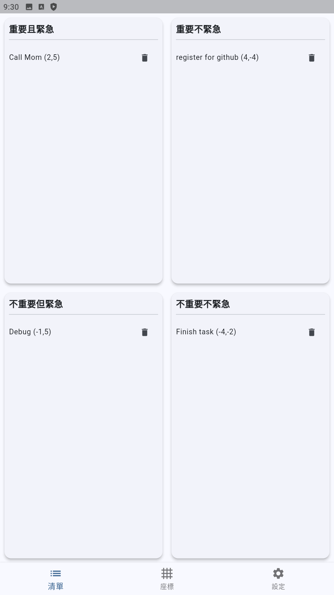
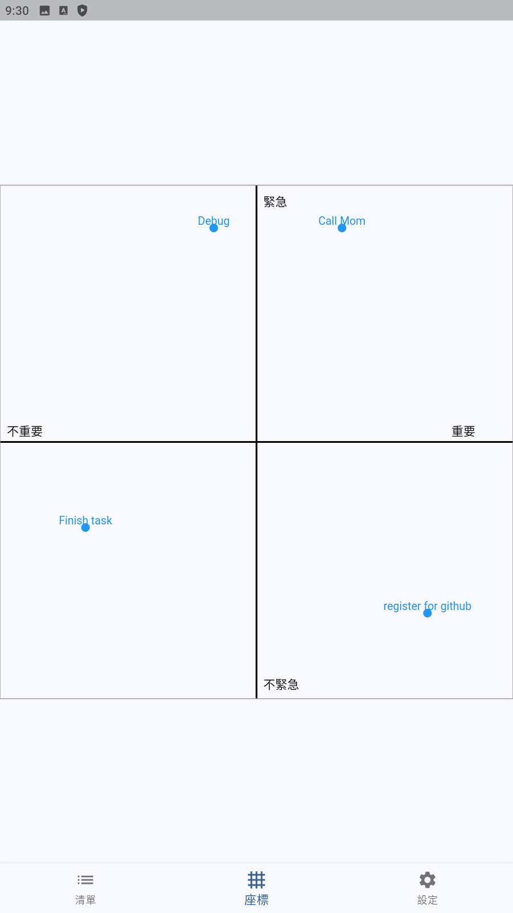
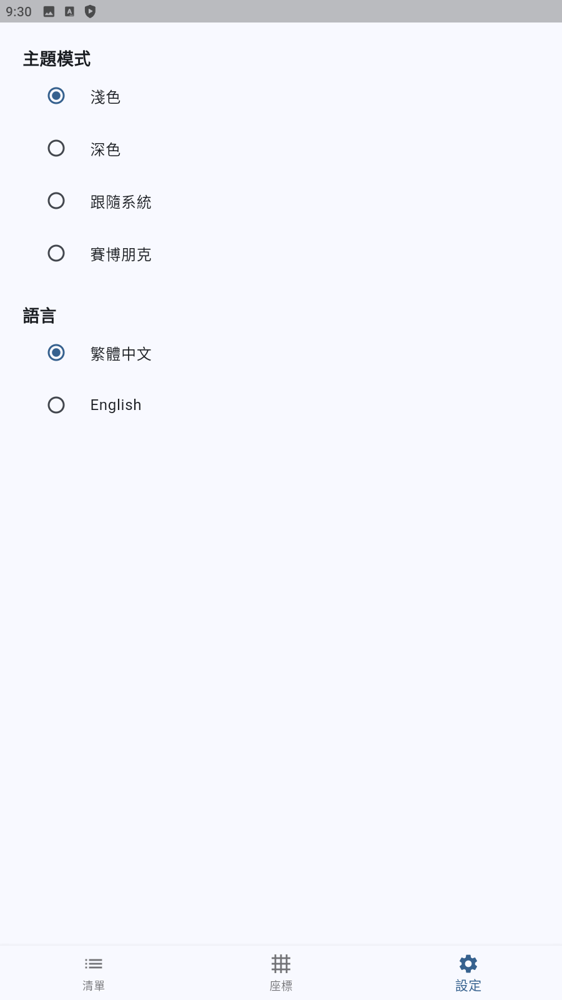
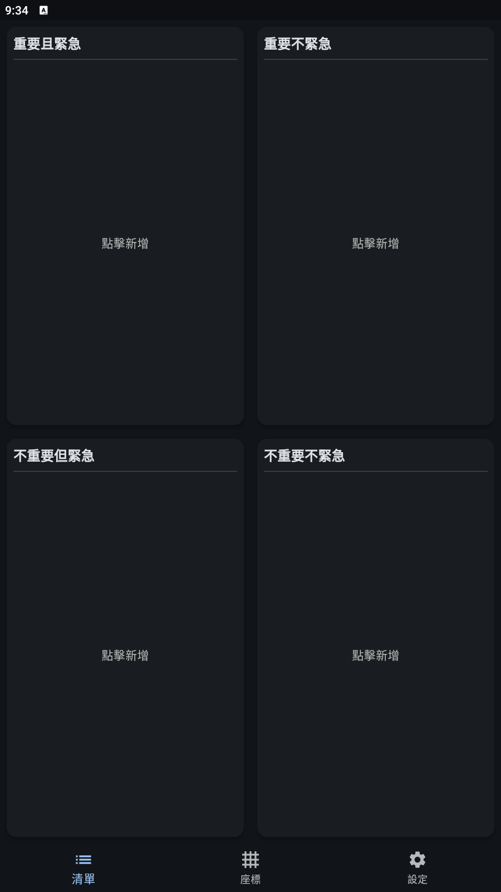
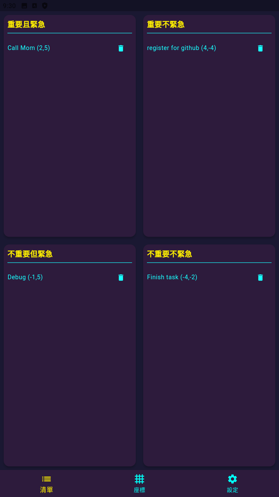

# Eisenhower Matrix Todo App
[English readme](https://github.com/LightSky10006/EisenhowerApp/blob/main/README_en.md)

艾森豪矩陣待辦事項（Eisenhower Matrix Todo App）

---

## 特色

- 四象限待辦清單（重要/緊急矩陣）
- 點擊象限空白處即可新增待辦
- 每個任務可自訂「重要」與「緊急」權重，並自動依象限限制範圍
- 平面座標分布視覺化，任務以（重要、緊急）權重顯示於座標圖
- 主題切換：淺色、深色、跟隨系統、賽博朋克2077（螢光黃/藍/紫）
- 支援中英文介面切換（繁體中文/English）
- UI 自適應螢幕，四象限自動填滿可用空間
- BottomNavigationBar（dock）切換頁面，顏色隨主題自動變化
- 所有主題色彩、座標軸、座標點、標籤皆自動同步主題

---

## 畫面預覽







---

## 如何使用

1. 安裝 [Flutter](https://flutter.dev/docs/get-started/install)
2. 下載本專案
3. 在專案資料夾執行：
   ```bash
   flutter pub get
   flutter run
   ```

---

## 主要檔案

- `lib/main.dart`：主程式，包含所有 UI、主題、語言切換邏輯
- `assets/`：App icon 與靜態資源

---

## 語言切換

- 設定頁可切換「繁體中文」與「English」
- 切換後所有介面文字即時變更

---

## 主題

- 支援四種主題：
  - 淺色
  - 深色
  - 跟隨系統
  - 賽博朋克（螢光黃/藍/紫）
- BottomNavigationBar、座標軸、點、標籤顏色皆會隨主題自動切換

---

## License

MIT
