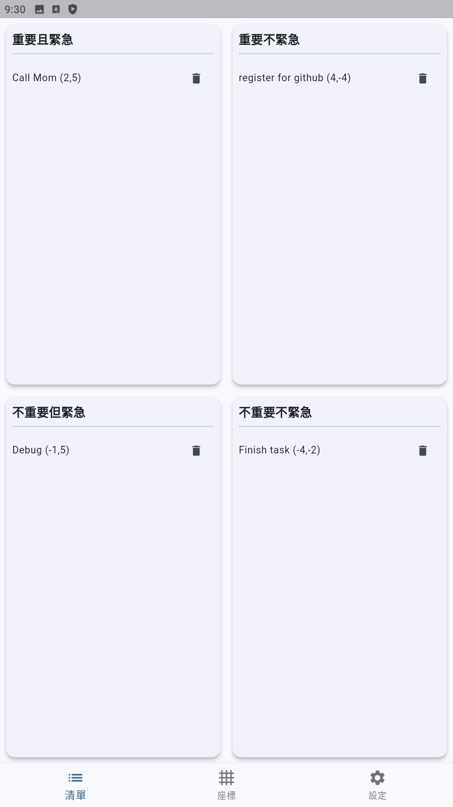
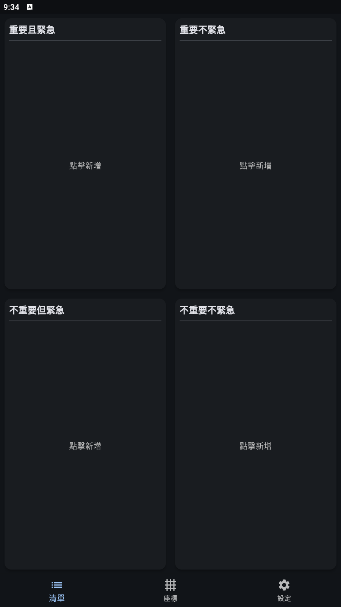

# Eisenhower Matrix Todo App
[中文說明](https://github.com/LightSky10006/EisenhowerApp/blob/main/README.md)

Eisenhower Matrix Todo App - A beautiful, modern productivity tool built with Flutter.

---

## Features

### Core Functionality
- **Four-Quadrant System**: Based on the Eisenhower Matrix important/urgent classification system
- **Dual View Mode**: List view and coordinate plane view, switchable via BottomNavigationBar
- **Complete Task Information**: Each task includes title (72 character limit) and description (400 character limit)
- **Smart Coordinate System**: Tasks visualized by (importance, urgency) weights on coordinate plane

### Interactive Experience
- **Click to Add**: Click quadrant space or coordinate plane space to add new tasks
- **Edit by Touch**: Click task points to directly edit task content
- **Weight Adjustment**: Custom "Importance" and "Urgency" weights (-5~+5) with automatic quadrant-based range limits
- **Coordinate Operations**: Coordinate plane supports zoom, pan, and double-tap reset

### Visualization & Themes
- **Coordinate Distribution**: GeoGebra-style professional coordinate system with grid, labels, and axes
- **Multi-Theme Support**: Light, Dark, System Follow, Cyberpunk 2077 (neon yellow/blue/purple)
- **Theme Consistency**: All theme colors, coordinate axes, points, and labels automatically sync with theme
- **Adaptive UI**: Four quadrants automatically fill available space, adapting to different screen sizes

### Localization & Settings
- **Bilingual Support**: Traditional Chinese/English interface switching
- **Data Persistence**: SQLite local storage with complete CRUD operations for tasks
- **Settings Page**: Dedicated settings page for convenient theme, language preference adjustments

---

## Screenshots







---

## How to Use

### Installation & Running
1. Install [Flutter](https://flutter.dev/docs/get-started/install)
2. Download this project
3. In the project folder, run:
   ```bash
   flutter pub get
   flutter run
   ```

### Basic Operations
- **Add Tasks**: Click quadrants in list view or click empty space in coordinate view
- **Edit Tasks**: Click task items or coordinate points to modify title, description, importance, and urgency
- **Delete Tasks**: Click delete button in edit dialog
- **Switch Views**: Use bottom navigation bar to switch between list view and coordinate view

### Advanced Features
- **Coordinate Zoom**: Use pinch gesture or mouse wheel in coordinate view
- **Coordinate Pan**: Drag coordinate plane to pan
- **Reset View**: Double-tap coordinate plane to reset zoom and position
- **Theme Switching**: Select preferred theme style in settings page
- **Language Switching**: Select Chinese or English interface in settings page

---

## Main Files

### Project Structure
```
lib/
├── main.dart                      # Main app logic, UI, theme, and language switching
├── models/
│   ├── task.dart                  # Task data model (title, description, coordinates, etc.)
│   └── app_enums.dart             # Application enum definitions
├── screens/
│   ├── eisenhower_list_screen.dart # Four-quadrant list view page
│   ├── quadrant_plane_screen.dart  # Coordinate plane view page
│   └── settings_screen.dart        # Settings page
├── widgets/
│   └── quadrant_painter.dart       # Custom coordinate drawing component
└── services/
    └── database_service.dart       # SQLite database service
```

### Database Structure
- Uses SQLite local storage
- Supports complete CRUD operations for tasks
- Automatically handles database version upgrades and schema changes

### Theme System
- Supports four themes: Light, Dark, System Follow, Cyberpunk
- All UI elements automatically adapt to theme colors
- Cyberpunk theme uses neon yellow/blue/purple color scheme

---

## Language Switching

- Supports Traditional Chinese and English bilingual interface
- Instant language switching in settings page
- All interface text, dialogs, and messages update immediately after switching
- Complete localization including quadrant labels, button text, error messages

---

## Theme System

### Available Themes
- **Light Theme**: Fresh white background, suitable for daytime use
- **Dark Theme**: Eye-friendly dark background, suitable for nighttime use
- **System Follow**: Automatically switches based on device system settings
- **Cyberpunk Theme**: Neon yellow/blue/purple colors, presenting futuristic tech feel

### Theme Features
- BottomNavigationBar colors automatically change with theme
- Coordinate axes, grid, labels, and task points completely sync with theme
- Cyberpunk theme uses professional neon color combinations
- All dialogs, buttons, and text colors automatically adapt

---

## Technical Features

### Architecture Design
- **Layered Architecture**: Clear separation of Model-View-Service
- **State Management**: Local state management using StatefulWidget
- **Responsive Design**: Adaptive to different screen sizes and orientations

### Performance Optimization
- **Custom CustomPainter**: High-performance coordinate plane rendering
- **Database Indexing**: Indexes created for quadrant, importance, urgency
- **Lazy Loading**: Performance optimization for large datasets

### User Experience
- **Touch-Friendly**: Button and control sizes suitable for touch operations
- **Visual Feedback**: Immediate feedback for button clicks, swipes, and other operations
- **Error Handling**: Friendly error messages and exception handling

---

## Update History

### v0.1.4+5
- ✅ Added task description feature (400 character limit)
- ✅ Fixed database upgrade issue, supporting description field
- ✅ Optimized coordinate point click detection accuracy
- ✅ Improved coordinate conversion algorithm, fixed coordinate offset during scaling
- ✅ Enhanced Cyberpunk theme visual effects
- ✅ Added character limit prompts and validation

### v0.1.3
- ✅ Implemented project modular refactoring
- ✅ Separated Model, View, Service layers
- ✅ Added SQLite database support
- ✅ Completed four-quadrant list and coordinate views

### v0.1.2
- ✅ Added Cyberpunk theme
- ✅ Implemented coordinate zoom and pan functionality
- ✅ Perfected theme switching system

### v0.1.1
- ✅ Added multi-language support
- ✅ Implemented basic Eisenhower Matrix functionality
- ✅ Completed core UI design

---

## Development Roadmap

### Coming Soon
- 🔄 Task category tag system
- 🔄 Task completion status tracking
- 🔄 Data export and backup functionality
- 🔄 Task reminders and notifications

### Future Plans
- 📋 Task statistics and analysis charts
- 📋 Cloud sync functionality
- 📋 Team collaboration features
- 📋 More themes and customization options

---

## License

MIT
